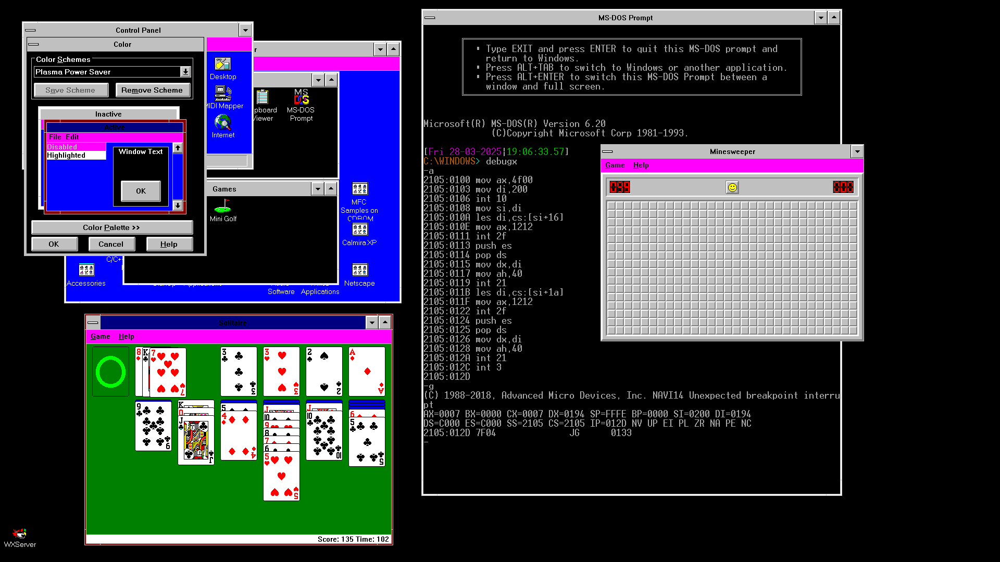

# vbesvga.drv and vddvbe.386
Modern Generic SVGA driver for Windows 3.1

This is a rewrite of the Windows 3.1 SVGA driver, designed to support **ALL** available 8-bit, 16-bit, 24-bit or 32-bit graphic modes on any system providing the [VESA BIOS Extensions](https://en.wikipedia.org/wiki/VESA_BIOS_Extensions) (hence the `VBE` in the name). It is based on the Video 7 SVGA driver included in the [Win16 Driver Development Kit](http://www.win3x.org/win3board/viewtopic.php?t=2776), with most of the hardware-specific code gutted out, and with support added for multi-byte pixels.

## Why on Earth did I make such a thing?

* To demonstrate that it's possible to run Windows 3.1 in True-Colour Full HD
* Because my AMD Radeon RX 5500 XT doesn't support 256-colour modes, rendering the old [VESA Patch](http://www.win3x.org/win3board/viewtopic.php?t=5408&hilit=svga) useless for me
* To help out any fellow enthusiasts who like running old software on new hardware!

## Screenshots

### Using standard Program Manager shell



This True-Colour Full HD screenshot, with large fonts, gives you some idea of what's working so far. The colour settings dialogue shows that pretty much the entire Windows GUI renders correctly, and the Program Manager shows icons working well too. The windowed 50-row DOS prompt demonstrates that I am running this on MS-DOS 6.20, and that I'm using a real AMD graphics card with [vendor string](https://fd.lod.bz/rbil/interrup/video/104f00.html) equal to `(C) 1988-2018, Advanced Micro Devices, Inc.` and [product name](https://fd.lod.bz/rbil/interrup/video/104f00.html) equal to `NAVI14`. Minesweeper and Solitaire both look OK, and the game underway indicates that the latter is eminently playable.

See the Issues page for more details of what is _not_ working at the moment...

### Using **third-party** [Calmira XP](https://winworldpc.com/product/calmira/4x) shell


This screenshot showcases the True Colour rendering capability, in the Windows-XP-derived icons used by the Calmira XP shell. The [Advanced Task Manager](https://winworldpc.com/product/advanced-task-manage/1x) instance again confirms that we're on DOS 6.20 and Windows 3.10. It also says we're on a 486, which of course isn't true, but that's just the newest CPU that Windows 3.1 knows about! The 40-row DOS prompt shows the output of `VIDMODES.COM` (see below), confirming again that I'm using a real AMD graphics card with [vendor string](https://fd.lod.bz/rbil/interrup/video/104f00.html) equal to `(C) 1988-2018, Advanced Micro Devices, Inc.` and [product name](https://fd.lod.bz/rbil/interrup/video/104f00.html) equal to `NAVI14` (reported a bit more legibly this time!).

## Building

Thanks to @lss4 for [pointing out some omissions](https://github.com/PluMGMK/vbesvga.drv/issues/19) in the setup process!

Note that the only step below which requires Windows is the initial installation of Visual C++ - the build process itself is purely DOS-based and can be automated using a batch file (or a Dosbox configuration file on a modern system!).

### `vbesvga.drv` (needed in both Standard and 386 Enhanced Mode)

* Install both the [Win16 DDK](http://www.win3x.org/win3board/viewtopic.php?t=2776) and [a contemporary version of Visual C++](http://www.win3x.org/win3board/viewtopic.php?t=1375)
* Obtain a copy of `EXE2BIN.EXE` (e.g. from FreeDOS, or from the Open Watcom compiler) and place it somewhere in your `PATH`
* Place the `VBESVGA` folder from this repository in the DDK hierarchy, at `286/DISPLAY/8PLANE/VBESVGA`
* Ensure `MSVCVARS.BAT` from Visual C++ has been run to setup the environment
* In addition, ensure `286\TOOLS` from the DDK is in your `PATH` and `286\INC` is in your `INCLUDE` variable
* Go to the `VBESVGA\mak` folder and run `make vbesvga.mak`; this should create the file `VBESVGA.DRV` which can be loaded by Windows

### `vddvbe.386` (needed only in 386 Enhanced Mode)

* Place the `VDDVBE` folder from this repository in the DDK hierarchy, at `386/VDDVBE`
* Ensure `MSVCVARS.BAT` from Visual C++ has been run to setup the environment
* In addition, ensure `386\TOOLS` from the DDK is in your `PATH`
* Go to the `VDDVBE` folder and run `nmake`; this should create the file `VDDVBE.386` which can be loaded by Windows

### Tip for using the DDK on a modern system

To make the debugger `WDEB386` work, you need to change some bytes:

* At position `63D8`, you need to change `0F 24 F0` to `66 33 C0`
* At position `63DF`, you need to change `0F 24 F8` to `66 33 C0`

This removes references to the [`TR6` and `TR7` registers](https://en.wikipedia.org/wiki/Test_register), which crash the system since they only existed on the 386, 486 and a few other less-well-known chips!

## Usage

The following changes are needed to your `C:\WINDOWS\SYSTEM.INI` file:

* In the `[boot]` section, change the `display.drv=` line to point to `vbesvga.drv`. You should specify the full path, or else copy the file to `C:\WINDOWS\SYSTEM`. (Note that if the path is too long, it can cause the CodeView debugger to crash on startup!)
* In the `[386Enh]` section, change the `display=` line to point to `vddvbe.386`. Again, you should specify the full path, or else copy the file to `C:\WINDOWS\SYSTEM`.
* Create a `[VBESVGA.DRV]` section to configure the driver, as detailed [below](#configuration-parameters).

## Configuration parameters

This table lists the parameters you can specify in the `[VBESVGA.DRV]` section of `SYSTEM.INI`.

|Parameter |Valid values |Meaning |Default value |
--- | --- | --- | ---
|`Width` | 640 - 65535 | Width in pixels of the desired video mode | 1024 |
|`Height` | 480 - 65535 | Height in scanlines of the desired video mode | 768 |
|`Depth` | 8 - 24 | Significant bits per pixel of the desired video mode ("significant" means that padding bits are excluded, so for example if you choose 24, both 24-bit and 32-bit modes will qualify) | 24 |
|`fontsize` | `small` or `large` | Choose whether to use 96dpi or 120dpi fonts | `small` |
|`dacdepth` | 6, 8 or `auto` | Significant bits to use per colour in 256-colour modes; `auto` means 8 if the BIOS advertises that 8 is supported, 6 otherwise; if 8 is specified then the driver attempts to use 8 regardless of what the BIOS says! | `auto` |
|`DoubleBufRefreshRate` | 0 - 255 | Number of times per second to swap buffers if [double-buffering](#linear-modes-and-double-buffering) is enabled; specifying a value less than 4 **disables** double-buffering | 60 |
|`PreferBankedModes` | 0 or 1 | If set to 1, then the driver searches for bank-switching modes **before** searching for linear modes; may be useful for debugging | 0 |
|`Allow3ByteMode` | 0 or 1 | Allow using modes with a *total* depth of 24 bits, which are (currently) subject to issues such as #15; disable this to prefer 32-bit modes which give the same colour depth but fewer glitches | 0 |

### Example configuration

```
[VBESVGA.DRV]
Width=1920
Height=1080
Depth=16
DoubleBufRefreshRate=75
```

## Linear Modes and Double Buffering

The VBE modes used by this driver involve a framebuffer larger than can be addressed by a single segment (65536 bytes). VBE provides two strategies for dealing with this: bank-switching and using linear framebuffers. Bank-switching involves mapping only one segment at a time into physical memory, usually at address `A0000h`, whereas a linear framebuffer gets fully mapped somewhere in extended memory (i.e. beyond the 1-MiB boundary). This driver prefers to use linear modes when available, but unfortunately, due to a bug in `DOSX.EXE`, this is not possible when running Windows in Standard Mode while using `EMM386`. To ensure the driver can use linear framebuffers, you will need to run Windows in 386 Enhanced Mode, or else disable `EMM386`.

When using a linear framebuffer, the driver also attempts to use [Double Buffering](https://wiki.osdev.org/Double_Buffering), which improves performance by ensuring that GDI operations never have to touch video RAM directly. However, it involves allocating two copies of the framebuffer in system RAM, which is quite expensive (especially given that Windows 3.1 usually can't take advantage of more than a quarter of a GiB). If it can't allocate this much RAM, it falls back to direct VRAM access.

Basically, if you're using 386 Enhanced Mode (or Standard Mode without `EMM386`), with a modern graphics card and a decent amount of system RAM, then the driver will probably enable Double Buffering. In that case, you can adjust the refresh rate using the `DoubleBufRefreshRate=` setting in `SYSTEM.INI`!

If you suspect there are problems with Double Buffering, you can force-disable it by setting `DoubleBufRefreshRate=0` (or any value less than 4). This can **significantly** degrade performance for certain operations on large screens, but may be useful for debugging...

## Mode selection

When Windows boots, the driver queries the BIOS for available modes, and automatically selects the first one which fulfills the following criteria:

* Supported by the current hardware according to the BIOS
* Graphics mode (not text)
* Colour mode (not black & white)
* Resolution matches what was specified in `SYSTEM.INI`
* Total bit depth (i.e. red+green+blue+padding) is exactly 1, 2 or 4 bytes (or 3 if `Allow3ByteMode=1`)
* Either packed-pixel or direct-colour framebuffer
* Significant bit depth (i.e. red+green+blue but without padding) matches what was specified in `SYSTEM.INI`

The driver searches for linear modes first, and if it can't find any (or the system can't support them), it goes back and looks for bank-switching modes. If it can't find any mode matching the above criteria, it will switch the display back to text mode, print an error message and return to DOS.

Note that this automatic search is currently the only way the driver selects modes: you cannot give it a specific VESA mode number to use.

### Having trouble finding compatible modes?

If you know what resolution your monitor and card support, then set the `Width` and `Height` accordingly, and the driver will either boot successfully or give you a list of `Depth` values to try (if the default isn't supported).

If you're not sure which resolution to try, the `VIDMODES.COM` tool included in the releases can list the available modes on your system to give some idea. Example output (also seen in the screenshot above):
```
Your card: 
(C) 1988-2018, Advanced Micro Devices, Inc. NAVI14 01.00

Available modes:
0110: 640*480*16
0111: 640*480*16
0113: 800*600*16
0114: 800*600*16
0116: 1024*768*16
0117: 1024*768*16
0119: 1280*1024*16
011A: 1280*1024*16
0165: 1280*960*16
0166: 1280*960*32
0121: 640*480*32
0122: 800*600*32
0123: 1024*768*32
0124: 1280*1024*32
0145: 1400*1050*16
0146: 1400*1050*32
0175: 1600*1200*16
0176: 1600*1200*32
01D2: 1920*1080*16
01D4: 1920*1080*32
01D8: 1280*720*16
01D9: 1280*720*32
```
Note that this lists the total depths rather than significant depths, so the depth list from the driver on boot failure may look a bit different.
